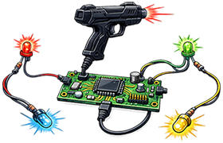

# OutputHooker

A modern reimagining of MAMEHooker, built for the latest Windows environments.  
This tool acts as the essential bridge between emulators and your arcade hardware (Lightguns, LEDs,...).

## Features
- **Windows Support**
  - Fully optimized for Windows 10 and 11, eliminating the stability and compatibility issues of MAMEHooker

- **Output Support**
  - Network - Receive output data over network connections for modern setups
  - Windows Messages - Full backward compatibility with the "old" Windows messaging system
  - This means that any emulator, launcher, or tool works with **OutputHooker**!

- **Hardware Support**
  - Lightguns with COM Port support (Blamcon, Fusion, GUN4IR, OpenFIRE, RS MX24, RS Reaper, X-Gunner)
  - Lightguns with TCP support (Sinden)
  - Positional Guns with USB HID support (Alien,...)
  - LEDWiz boards (Original, Clone, Pinscape)
  - Ultimarc LED boards
  - WLED boards (JSON API, UDP Realtime)
  - Gamecontrollers with SDL3 support (Force Feedback)
  - Any hardware that receives TCP/UDP or USB HID commands

- **INI Support**
  - MAMEHooker INI files and KeyStates are supported
  - **OutputHooker** features a built-in editor inspired by the original MAMEHooker workflow,  
     allowing you to configure hardware triggers without leaving the app

- **MAME Universal State Outputs (LUA) Support**
  - [MAME LUA outputs](https://github.com/djGLiTCH/MAME-LUA-SCRIPT-STATE-OUTPUTS) by djGliTCH are supported

## Getting Started
1. Download the latest build from the [Releases](https://github.com/PolybiusExtreme/OutputHooker/releases) page

2. Configure your emulator (e.g. MAME) to broadcast outputs via TCP or Windows Messages

3. Launch the application, start a game and use the INI Editor to define your hardware mappings

4. **Watch your cabinet come to life!**

## Support
See the [Wiki](https://github.com/PolybiusExtreme/OutputHooker/wiki) for detailed instructions.  
Due to time constraints, I cannot offer any support.  
I am just one man that wanted to build a modern MAMEHooker alternative for my selfmade Arcade machine.

## Contributing
If you have suggestions, bug reports, or want to contribute to the code, feel free to open an [issue](https://github.com/PolybiusExtreme/OutputHooker/issues) or submit a [pull request](https://github.com/PolybiusExtreme/OutputHooker/pulls).

## Build
Most of the application is Qt-based, so you'll need the Qt environment along with the MSVC 2022 toolchain.  
For the hardware side, I’ve integrated the improved LEDWiz SDK,  
the PacDrive SDK for Ultimarc LED boards,  
the HIDAPI library for generic USB HID devices  
and the SDL3 library for generic gamecontrollers.
- Qt 6.10.2 with a CMake file with MSVC 2022
- CMake Version: 3.30.5
- LEDWiz SDK - [https://github.com/mjrgh/lwcloneu2](https://github.com/mjrgh/lwcloneu2)
- Ultimarc PacDrive SDK - [https://www.ultimarc.com/PacDriveSDK.zip](https://www.ultimarc.com/PacDriveSDK.zip)
- libusb HIDAPI library - [https://github.com/libusb/hidapi](https://github.com/libusb/hidapi)
- libsdl SDL3 library - [https://github.com/libsdl-org/SDL](https://github.com/libsdl-org/SDL)

## ToDo
- Add support for display files

## Credits
- Howard Casto (MAMEHooker & MAME Interop SDK developer)  
- Ben Baker (MAME Interop SDK & Ultimarc SDK developer)  
- Aaron Giles (MAME output code developer)
- 6Bolt ([Hook of the Reaper](https://hotr.6bolt.com/) developer)

## Special Thanks
- Hexxed123
- djGliTCH
- Cheesmaker
- Bandicoot37  

and all other users for their feedback and support!

***
**Copyright &copy; 2026 by PolybiusExtreme**
